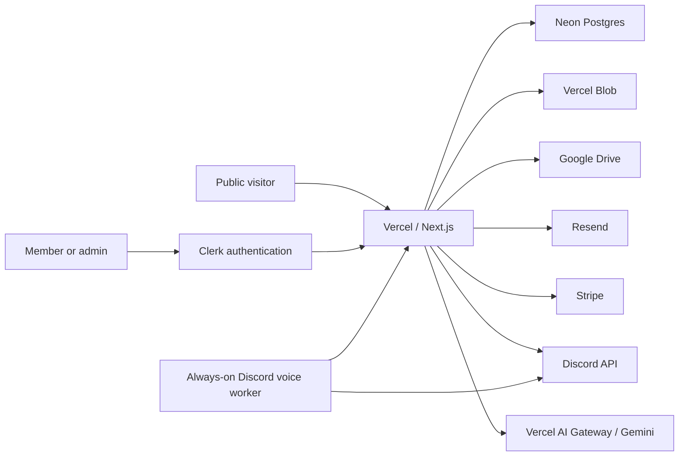

# Architecture

## System overview

The platform is a single Next.js 16 application with public, member, admin, documentation, and API surfaces. Vercel runs the web application and scheduled jobs. Neon is the source of truth for structured data. Clerk supplies identity, while the application database controls approval status, organization roles, and effective permissions.

## Application boundaries

### Public routes

The public site lives under `src/app` and includes the home page, programs, projects, team directory, member directory, news, events, sponsors, resources, gallery, forms, availability polls, donations, legal pages, and contact/join flows.

Most public content has a hard-coded fallback so builds and public pages remain usable if the database is temporarily unavailable. Published database records override those defaults without requiring a deployment.

### Member portal

`/portal` requires a Clerk session and an `ACTIVE` member record. New identities are created as `PENDING` unless the email matches the configured initial super-admin address. Suspended and pending members cannot reach active-member tools.

The portal includes:

- profile and public-directory preferences;
- attendance scanner and signed check-in links;
- hours, time sessions, and contributions;
- activity and attendance history;
- forms, polls, tasks, docs, engineering notebook, and operational workspaces;
- account connections and sign-out.

### Admin surfaces

`/admin`, `/admin/control-center`, and `/admin/operations` require an active member with effective administrative permissions. Each page, Server Action, route handler, upload endpoint, export, and database mutation must repeat the applicable authorization check. The proxy is not the sole authorization boundary.

### Documentation hostname

`src/proxy.ts` provides host-aware routing:

- `docs.210robotics.com/` rewrites internally to `/docs`;
- `/docs`, `/doxygen`, API assets, and Next.js assets remain on the docs hostname;
- other docs-host paths redirect to the equivalent path on `210robotics.com`;
- the same application artifact therefore serves both sites.

Generated Doxygen output is stored in `public/doxygen`. The wiki links to `/doxygen/index.html`.

## Identity and authorization

Clerk owns credentials, SSO, verification, session security, and password recovery. Neon owns organization-specific state:

- approval status;
- display name and public profile;
- access preset;
- permission allow/deny overrides;
- team/project assignments;
- hours, contributions, attendance, and administrative records.

Role presets and permission evaluation live in `src/lib/permissions.ts`. Explicit deny overrides win over role grants and explicit allow overrides. `SUPER_ADMIN` is the only preset with `access.manage`.

Clerk webhooks relink identities by email and synchronize account lifecycle events without overwriting database-managed profile content after creation.

## Data model

The Drizzle schema is in `src/db/schema.ts`; generated SQL is committed under `drizzle/`.

Major data areas:

| Area | Representative tables |
| --- | --- |
| Membership | members, projects, memberProjects |
| Time and contributions | hourEntries, timeSessions, contributions |
| Events and attendance | teamActivities, attendanceTokens, activityAttendance |
| Wiki and files | docCategories, docPages, docRevisions, internalDocuments |
| Forms and polls | publicForms, publicFormResponses, availabilityPolls |
| Public content | mediaAssets, galleryEvents, publicProfileCards, sponsors, posts, resources |
| Communications | inquiries, emailDeliveries, calendarSnapshots |
| Engineering | engineeringSeasons, engineeringProjects, engineeringSubsystems, parts, manufacturing, notebook, scouting |
| Operations | memberTasks, meetingNotes, decisions, glossary, inventory, purchasing, design changes |
| Finance | financePlans, financeEntries, sponsor commitments, donation campaigns, donations, dues |
| Discord | guilds, channels, linked members, events, messages, reminders |
| Governance | publicSettings, auditEvents |

The database client is initialized lazily in `src/db/index.ts`, preventing build-time evaluation from requiring runtime credentials.

## File storage

### Public media

Vercel Blob stores normalized website, member, post, roster, sponsor, and gallery media. Database metadata identifies purpose and ownership. Profile or content uploads do not automatically become gallery items.

### Private documents

A separate private Blob token stores internal documents and generated assets. Private downloads are served through authorized route handlers rather than public Blob URLs.

### Google Drive

Drive is used for:

- gallery photo synchronization;
- team documentation import/archive;
- sponsor-source data when configured;
- meeting recording and transcript archive.

Gallery synchronization supports authenticated service-account access and a public-folder fallback. Scheduled sync and manual refresh use the same source-of-truth logic.

## Integrations

### Email

Contact, join, and sponsor inquiries are stored before email delivery. Resend sends the administrative notification and submitter confirmation. Delivery status is retained in Neon so a provider outage does not discard the inquiry.

### Calendar

The public calendar is embedded from the shared Google Calendar. Calendar snapshots and refresh controls provide immediate display updates without making attendance depend on calendar event times.

### Stripe

Stripe Checkout accepts donations. Signed webhooks record checkout state and reconcile successful donations into finance records.

### Discord

Vercel route handlers support interactions, message events, reminders, command configuration, and administrative tools. Voice recording requires an always-on worker because WebSocket and UDP voice connections cannot run inside request-bound Vercel Functions.

### AI

The team assistant and meeting transcription can use Vercel AI Gateway or Gemini. The application treats generated output as assistance; permission checks and user confirmation remain required for mutations.

## Runtime and caching

- Public content can use timed revalidation and on-demand path revalidation.
- Member and admin data is request-specific and not shared across users.
- Upload, webhook, cron, export, and integration routes use the Node.js runtime.
- Long-running persistent processes are kept outside Vercel.
- All service clients are initialized lazily so `next build` succeeds without runtime-only variables.
